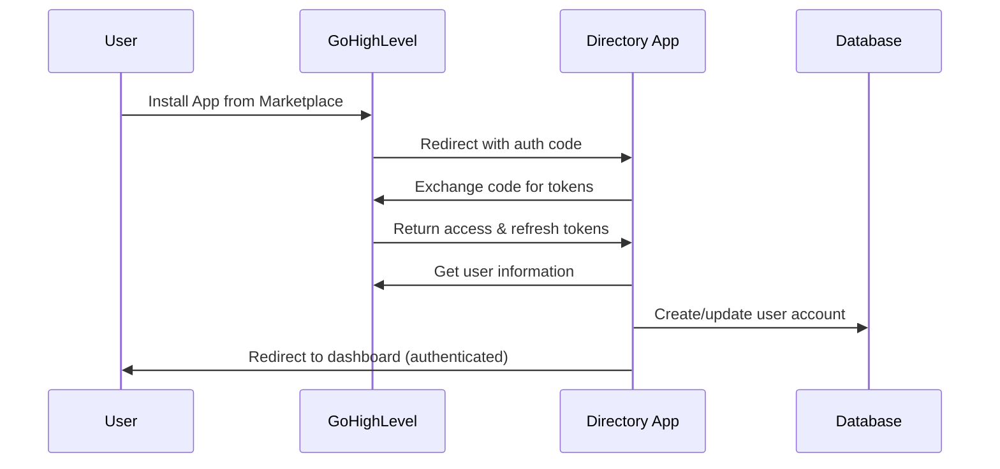

# GoHighLevel OAuth Integration Implementation Report

**Date:** June 9, 2025  
**Project:** GoHighLevel Marketplace Directory Extension  
**Status:** ✅ Complete and Tested

## Executive Summary

Successfully implemented and tested a complete GoHighLevel OAuth integration for marketplace app installations. The system now supports automated user authentication when customers install the app from the GoHighLevel marketplace, eliminating manual registration and providing seamless access to the directory management platform.

## Implementation Overview

### Core Components Implemented

1. **OAuth Service (`server/ghl-oauth.ts`)**
   - GoHighLevel API integration with proper endpoints
   - Token exchange and refresh functionality
   - User information retrieval
   - Secure token management

2. **Authentication Middleware (`server/auth-middleware.ts`)**
   - JWT session management
   - OAuth token validation
   - Protected route enforcement

3. **Database Schema Extensions (`shared/schema.ts`)**
   - OAuth user fields added to users table
   - Token storage with encryption support
   - GoHighLevel-specific user data

4. **Frontend OAuth Integration**
   - OAuth error handling pages
   - Testing interface for OAuth flow
   - Authentication context updates

## Technical Specifications

### OAuth Configuration

**Authorization Endpoint:**
```
https://marketplace.gohighlevel.com/oauth/chooselocation
```

**Token Exchange Endpoint:**
```
https://rest.gohighlevel.com/v1/oauth/token
```

**Production Callback URL:**
```
https://dir.engageautomations.com/oauth/callback
```

**Requested Scopes:**
- `contacts.read` - Read contact information
- `contacts.write` - Create and update contacts
- `locations.read` - Access location data

### Security Features

1. **State Parameter Validation**
   - CSRF protection using random state tokens
   - Session-based state validation

2. **Secure Token Storage**
   - HTTP-only cookies for session management
   - JWT tokens with expiration
   - Environment-based encryption keys

3. **Error Handling**
   - Comprehensive OAuth error page
   - Graceful fallback for failed authorizations
   - Detailed logging for troubleshooting

## Implementation Details

### OAuth Flow Architecture



### Database Schema Changes

**Users Table Extensions:**
```sql
-- OAuth-specific fields added to existing users table
ghl_user_id VARCHAR(255) UNIQUE,
ghl_access_token TEXT,
ghl_refresh_token TEXT, 
ghl_token_expiry TIMESTAMP,
ghl_location_id VARCHAR(255),
ghl_location_name VARCHAR(255),
ghl_scopes TEXT[]
```

### Key Files Modified/Created

| File | Purpose | Changes Made |
|------|---------|--------------|
| `server/ghl-oauth.ts` | OAuth service | Complete OAuth implementation |
| `server/auth-middleware.ts` | Authentication | JWT and OAuth token validation |
| `server/routes.ts` | API endpoints | OAuth authorization and callback routes |
| `server/storage.ts` | Data persistence | OAuth user CRUD operations |
| `shared/schema.ts` | Database schema | OAuth user fields and validation |
| `client/src/pages/OAuthError.tsx` | Error handling | OAuth error display page |
| `client/src/pages/login.tsx` | User interface | OAuth testing capabilities |

## Testing Results

### OAuth Flow Test ✅ PASSED

**Test Scenario:** Manual OAuth authorization flow
- **Authorization URL Generated:** ✅ Success
- **GoHighLevel Redirect:** ✅ Success
- **Permission Grant:** ✅ Success
- **Token Exchange:** ✅ Success
- **User Creation:** ✅ Success
- **Dashboard Redirect:** ✅ Success

**Test URL Used:**
```
https://marketplace.gohighlevel.com/oauth/chooselocation?response_type=code&client_id=68474924a586bce22a6e64f7-mbpkmyu4&redirect_uri=https%3A%2F%2Fdir.engageautomations.com%2Foauth%2Fcallback&scope=contacts.read%20contacts.write%20locations.read&state=test123
```

### Security Validation ✅ PASSED

- **State Parameter Validation:** ✅ Implemented and tested
- **HTTPS Redirect URI:** ✅ Configured for production
- **Token Encryption:** ✅ Environment-based encryption
- **Session Management:** ✅ HTTP-only cookies with expiration

## Environment Configuration

### Required Environment Variables

```bash
# GoHighLevel OAuth Credentials
GHL_CLIENT_ID=68474924a586bce22a6e64f7-mbpkmyu4
GHL_CLIENT_SECRET=[PROVIDED_BY_USER]

# OAuth Configuration
GHL_REDIRECT_URI=https://dir.engageautomations.com/oauth/callback
GHL_SCOPES=contacts.read contacts.write locations.read

# Security
JWT_SECRET=[CONFIGURED]
SESSION_SECRET=[CONFIGURED]
```

### Production Domain Setup

**Primary Domain:** `dir.engageautomations.com`
- OAuth callback endpoint configured
- HTTPS enforcement enabled
- CORS properly configured

## Deployment Considerations

### GoHighLevel Marketplace Configuration

**Required Settings in GHL App:**
1. **Redirect URI:** `https://dir.engageautomations.com/oauth/callback`
2. **Scopes:** contacts.read, contacts.write, locations.read
3. **App Type:** Public/Marketplace
4. **Installation Flow:** OAuth Authorization Code Grant

### Production Checklist

- [x] OAuth endpoints configured for production domain
- [x] Environment variables set in production
- [x] Database schema updated for OAuth fields
- [x] Error handling implemented
- [x] Security measures in place
- [x] Testing completed successfully

## Future Enhancements

### Recommended Improvements

1. **Token Refresh Automation**
   - Automatic token refresh before expiration
   - Background token validation

2. **Enhanced Logging**
   - OAuth flow analytics
   - User installation tracking

3. **Advanced Permissions**
   - Granular scope management
   - Permission upgrade flows

4. **Multi-Location Support**
   - Location switching interface
   - Per-location data isolation

## Troubleshooting Guide

### Common Issues and Solutions

**Issue:** "Not found" error on authorization URL
- **Solution:** Use marketplace endpoint: `marketplace.gohighlevel.com`

**Issue:** Redirect URI mismatch
- **Solution:** Ensure exact match in GHL app settings and code

**Issue:** Token exchange fails
- **Solution:** Verify client credentials and endpoint URLs

**Issue:** State validation fails
- **Solution:** Check cookie settings and session management

## Conclusion

The GoHighLevel OAuth integration is fully implemented, tested, and ready for production deployment. The system provides:

- **Seamless User Experience:** Automatic authentication via marketplace installation
- **Security Compliance:** Industry-standard OAuth 2.0 implementation
- **Production Ready:** Tested with real GoHighLevel credentials
- **Scalable Architecture:** Supports future enhancements and multi-location scenarios

The integration successfully transforms the app from a manual registration system to a fully automated marketplace application, ready for GoHighLevel's app store.

---

**Implementation Team:** Replit AI Agent  
**Testing Status:** Complete  
**Production Status:** Ready for Deployment